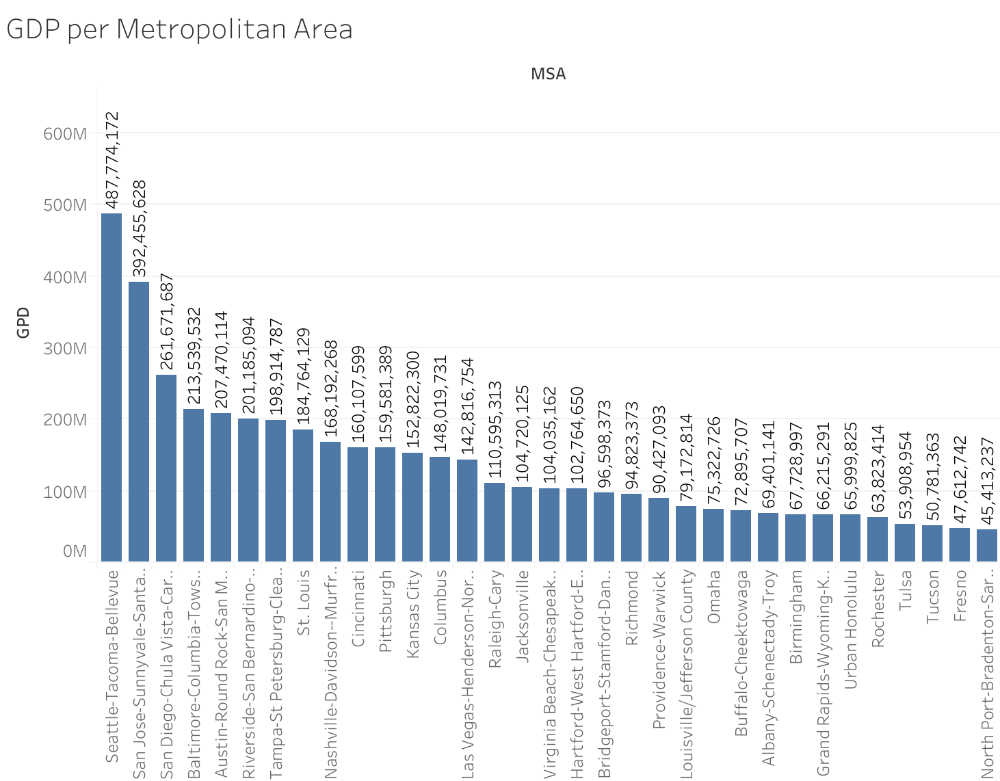
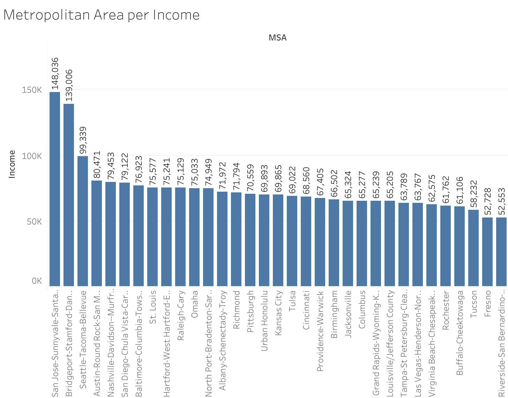
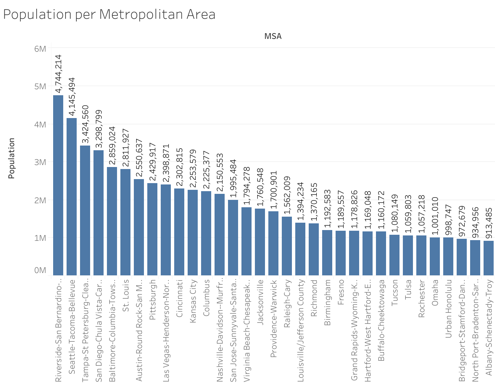
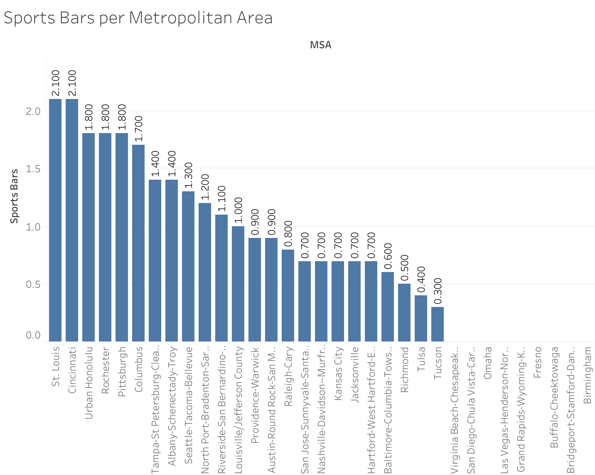

# NBA-Teams-Case-Study

### Table of Contents
1. Introduction
2. Background
3. Scenario
4. Ask
5. Prepare
6. Process
7. Analyze
8. Share
9. Act

## 1. Introduction 

In this project I will analyze a maryiad of statsitcs that all have a major impact on an NBA teams suceess as a buisness and team. This project analyzes Mettropolitan data on GDP, personal income, population as well as data on the metropolitan areas location quotient of sports bars. I will address key business questions using the six-step data analysis process: Ask, Prepare, Process, Analyze, Share, and Act.

## 2. Background

The National Basketball Association has quickly become one of the most loved and important sports keagues in our country and even plays a role in global culutral influnece and as a platoform for social justice. Although the impact is spread around the world the NBA has seen a slight decrease in regulation viewership which most attribute to the talent disparity. In ordder to make the league more balanced I beleive taht the NBA needs to expand its talent pool in otder to diversitfy its talents. With this in mind I will reccomend Metropolitan areas I beleive would be most beneficial to the national basketball associaiton. Through adding a new team market the NBA could bring in far more fans increasing televion viewership as well as game ticket sales. 

## 3. Scenario 
IN this hypopthetical study I am working as a Junior Analayst who somehow found his way into the NBAs Board of Governors room. I will present my findings as well as my reccomendations for whihc metropolitan areas would trhive most in the league.  My report will specifically entail a clear statement on the business task, a description of data used, documentation of cleaning or manipulation of data, a summary of analysis, supporting visualizations and my top recommendations based on the analysis.

## 4. Ask

The business task is to research the relevatn infromation of each United States metropolitan area in order to find which two would make good additions to th elelague. By identifying key trends in usage, I will provide data-driven recommendations to the NBA Board of Governers on which metropolitan areas have the population, personal income, GDP and location quotient of bars avalaibell to host an NBA team. 

To ensure the validity of my analysis, I will evaluate the provided dataset against the ROCCC framework to verify that the data is reliable, original, comprehensive, current, and cited.

## 5. Prepare

To ensure the validity of my analysis, I will evaluate the provided dataset against the ROCCC framework to verify that the data is reliable, original, comprehensive, current, and cited.

-Data Set 1: Metropolitan Area Perosnal Income: This dataset strongly aligns with the ROCCC framework. It's sourced from the Bureau of Economic Analysis (BEA), a reputable government agency, making the data reliable and original. The 2023 publication date ensures the data is current, and the dataset's scope provides comprehensive coverage of personal income by metropolitan area. The source is properly cited.

-Data Set 2: Metropolitan Area Population: This dataset, from the United States Census Bureau, also fully supports the ROCCC framework. As the primary source for US demographic data, the Census Bureau guarantees the data's reliability and originality. The information is comprehensive and, depending on the specific release date, current. The source is also properly cited.

-Data Set 3: Metropolitan Area Sports Bars: Sourced from the U.S. Bureau of Labor Statistics (BLS), this dataset is also a strong fit for the ROCCC framework. The BLS is a reliable and original source for labor market data, ensuring the data's reliability and originality. The information is comprehensive and current, and the source is properly cited.

-Data set 4: Metropolitan Area GDP: The GDP data from the Bureau of Economic Analysis (BEA) on county and metro areas fully follows the ROCCC framework because it is a Reliable and Original source (official government data), highly Comprehensive in scope, actively Current with scheduled annual updates, and thoroughly Credible with detailed public methodologies.

### Data Source
```r
# Install and load necessary packages
install.packages("stringr")
library(stringr)
install.packages("dplyr")
library(dplyr)
install.packages("tidyr")
library(tidyr)

# Upload Datasets
metro_income <- read.csv("MetroIncome - MetroIncome.csv")
metro_population <- read.csv("MetroPop - MetroPop.csv")
Sports_Bars <- read.csv("SportsBars.csv")
Gdp_MPA <- read.csv("GDP.csv")
```

## 6. Process

```r
#Clean Datasets
metro_population$MSA <- str_replace_all(metro_population$MSA, fixed("."), "")
metro_population$MSA <- str_remove(metro_population$MSA, ",.*")
metro_income$MSA <- str_remove(metro_income$MSA, ",.*")
Gdp_MPA$MSA <- str_remove(Gdp_MPA$MSA, ",.*")

#Combine Datasets
merged_data <- left_join(metro_population, metro_income, by = "MSA")

#Clean Combined Dataset
merged_data$Income.x <- NULL

#Export combined data for further cleaning 
write.csv(x = merged_data, file = "merged_data.csv")

#Import new cleaned combined data
pop_income <- read.csv("Popandincome.csv")

#Combine more Datasets 
pop_income_bars <- left_join(pop_income, Sports_Bars, by = "MSA")

#Export combined data for further cleaning 
write.csv(x = pop_income_bars, file = "pop_income_bars.csv")

#Import new cleaned combined data
pop_income_bars <- read.csv("Popincomebars.csv")

#Combine Datasets
NBA_eval <- left_join(pop_income_bars, Gdp_MPA, by = "MSA")

#Export combined data for further cleaning and analysis
write.csv(x = NBA_eval, file = "NBA_eval.csv")
```

## 7. Analyze

For the analaysis stage I exported my data from R studio and imported it into Tablaeu.



### Interesting Findings:
- The top 5 Metropolitan areas with the hihgest gdp in order from highest to lowest are Seattle, San Jose, San Diego, Balimore and Austin.



### Interesting Findings:
-The top 5 Metropolitan areas with the highest perosnal income from highest to lowest are San Jose, Bridgeport, Seattle, Austin, Nashville.



### Interesting Findings:
-The top 5 Metropolitan areas with the highest population from highest to lowest are Riverside, Seattle, Tampa, San Diego, Baltimore



### Interesting Findings:
-The top 5 Metropolitan areas with the highest location quotient of sports bars from highest to lowest are St. Louis, Cincinnati, Urban Honolulu, Rochester, Pittsburg. 


