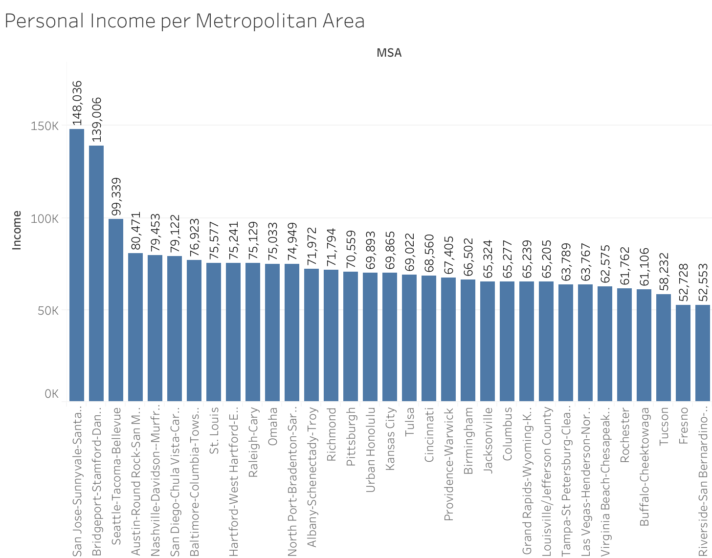

# NBA-Teams-Case-Study

### Table of Contents
1. Introduction
2. Background
3. Scenario
4. Ask
5. Prepare
6. Process
7. Analyze
8. Share
9. Act

## 1. Introduction 

In this project, I will analyze a myriad of statistics that all have a major impact on an NBA team's success as a business and as a team. This project specifically analyzes metropolitan data on GDP, personal income, and population, as well as data on the metropolitan area's location quotient of sports bars. I will address key business questions using the six-step data analysis process: Ask, Prepare, Process, Analyze, Share, and Act.

## 2. Background

The National Basketball Association has quickly become one of the most loved and important sports leagues in our country and even plays a role in global cultural influence and as a platform for social justice. Although the impact is spread around the world, the NBA has seen a slight decrease in regular season viewership, which most attribute to the talent disparity. In order to make the league more balanced, I believe that the NBA needs to expand its talent pool in order to diversify its talent. With this in mind, I will recommend metropolitan areas I believe would be most beneficial to the National Basketball Association. Through adding a new team market, the NBA could bring in far more fans, increasing television viewership as well as game ticket sales. 

## 3. Scenario 

In this hypothetical study, I am working as a Junior Analyst who somehow found his way into the NBA's Board of Governors room. I will present my findings as well as my recommendations for which metropolitan areas would thrive most in the league. My report will specifically entail a clear statement on the business task, a description of the data used, documentation of the cleaning or manipulation of data, a summary of analysis, supporting visualizations, and my top recommendations based on the analysis.

## 4. Ask

The business task is to research the relevant information of each United States metropolitan area in order to find which two would make good additions to the league. By identifying key trends in economic and demographic data, I will provide data-driven recommendations to the NBA Board of Governors on which metropolitan areas have the population, personal income, GDP, and location quotient of bars available to host an NBA team.

To ensure the validity of my analysis, I will evaluate the provided dataset against the ROCCC framework to verify that the data is reliable, original, comprehensive, current, and cited.

## 5. Prepare

To ensure the validity of my analysis, I will evaluate the provided dataset against the ROCCC framework to verify that the data is reliable, original, comprehensive, current, and cited.

-Data Set 1: Metropolitan Area Personal Income: This dataset strongly aligns with the ROCCC framework. It is sourced from the Bureau of Economic Analysis (BEA), a reputable government agency, making the data Reliable and Original. The recent publication date (e.g., 2023) ensures the data is Current, and the dataset's scope provides Comprehensive coverage of personal income by metropolitan area. The source is properly Cited.

-Data Set 2: Metropolitan Area Population: This dataset, from the United States Census Bureau, also fully supports the ROCCC framework. As the primary source for U.S. demographic data, the Census Bureau guarantees the data's Reliability and Originality. The information is Comprehensive and, depending on the specific release date, is highly Current. The source is also properly Cited.

-Data Set 3: Metropolitan Area Sports Bars (Location Quotient): Sourced from the U.S. Bureau of Labor Statistics (BLS), this dataset is also a strong fit for the ROCCC framework. The BLS is a Reliable and Original source for labor market data, ensuring data quality. The information is Comprehensive and Current, and the source is properly Cited.

-Data Set 4: Metropolitan Area GDP: The GDP data from the Bureau of Economic Analysis (BEA) on county and metro areas fully follows the ROCCC framework because it is a Reliable and Original source (official government data), highly Comprehensive in scope, actively Current with scheduled annual updates, and thoroughly Cited with detailed public methodologies.

```r
# Install and load necessary packages
install.packages("stringr")
library(stringr)
install.packages("dplyr")
library(dplyr)
install.packages("tidyr")
library(tidyr)

# Upload Datasets
metro_income <- read.csv("MetroIncome - MetroIncome.csv")
metro_population <- read.csv("MetroPop - MetroPop.csv")
Sports_Bars <- read.csv("SportsBars.csv")
Gdp_MPA <- read.csv("GDP.csv")
```

## 6. Process

```r
#Clean Datasets
metro_population$MSA <- str_replace_all(metro_population$MSA, fixed("."), "")
metro_population$MSA <- str_remove(metro_population$MSA, ",.*")
metro_income$MSA <- str_remove(metro_income$MSA, ",.*")
Gdp_MPA$MSA <- str_remove(Gdp_MPA$MSA, ",.*")

#Combine Datasets
merged_data <- left_join(metro_population, metro_income, by = "MSA")

#Clean Combined Dataset
merged_data$Income.x <- NULL

#Export combined data for further cleaning 
write.csv(x = merged_data, file = "merged_data.csv")

#Import new cleaned combined data
pop_income <- read.csv("Popandincome.csv")

#Combine more Datasets 
pop_income_bars <- left_join(pop_income, Sports_Bars, by = "MSA")

#Export combined data for further cleaning 
write.csv(x = pop_income_bars, file = "pop_income_bars.csv")

#Import new cleaned combined data
pop_income_bars <- read.csv("Popincomebars.csv")

#Combine Datasets
NBA_eval <- left_join(pop_income_bars, Gdp_MPA, by = "MSA")

#Export combined data for further cleaning and analysis
write.csv(x = NBA_eval, file = "NBA_eval.csv")
```

## 7. Analyze

For the analysis stage, I exported my data from RStudio and imported it into Tableau.


### Interesting Findings:

- The top five metropolitan areas with the highest GDP, in order from highest to lowest, are Seattle, San Jose, San Diego, Baltimore, and Austin.



### Interesting Findings:

-The top five metropolitan areas with the highest personal income, in order from highest to lowest, are San Jose, Bridgeport, Seattle, Austin, and Nashville.


### Interesting Findings:

-The top 5 metropolitan areas with the highest population from highest to lowest are Riverside, Seattle, Tampa, San Diego, and Baltimore.


### Interesting Findings:

-The top 5 metropolitan areas with the highest location quotient of sports bars from highest to lowest are St. Louis, Cincinnati, Urban Honolulu, Rochester, and Pittsburgh.

## 8. Share

Below is a link to my Google Slides presentation of the case study:

[Case Study Presentation](https://docs.google.com/presentation/d/1QciFCHY_gfdBa2ID1F8N1-aNf3c98sAK9rZLd_ifQUw/edit?usp=sharing)

## 9. Act:

### Key Takeaways

- San Jose the secondd highest GDP, highest personal income, middle of the pack population but a low number of sports bars.
- Seattle has the highest GDP, third highest personal income, second highest population and a avereage number of sports bars.
- St. Louis hsa the 8th highest GDP and personal income sixth highest population and tied for the highest nyumber of sports bars.
- Tampa has the 7th highest GDP, one of the lowest personal icomes, 3rd highest population and an above averaege number of sports bars.
- San diego has the third highest GDP 6th highest personal income 4th highest population while the location quotient of sports bars is NA.
- Baltimore has the 4th highest GDP, 7th highest personal income, 5th highest population and a below averaege mumber of sports bars.
- Las Vegas has a middle of the pack GDP and low personal income however the 9th largest population not including tourism and the location quotient of sports bars is NA.

### Reccomednations

  Seattle and St. Louis are the clear strategic choices for the next two NBA expansion markets. Seattle is the safer, high-return option because of its massive economic profile, featuring the highest GDP and highest personal income, ensuring a wealthy fanbase can support a premium franchise. Moreover, the city already has a proven, hungry fanbase and modern arena infrastructure ready to resurrect the SuperSonics immediately. St. Louis, while lacking a prior NBA team, offers huge growth potential, supported by a large population, respectable economic indicators, and crucially, one of the nation's highest concentrations of sports bars—a powerful metric that signals a deeply passionate, communal sports market ready for a new team and providing an excellent platform for league engagement and reaching new audiences.
